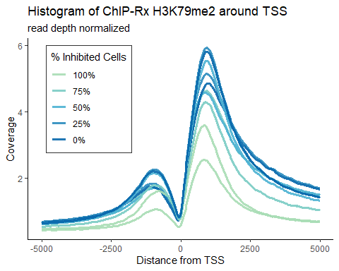
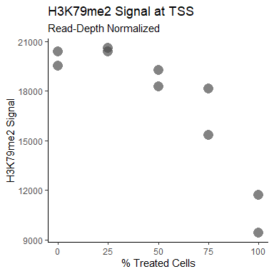
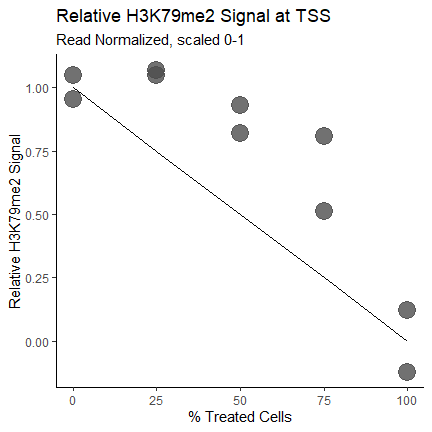
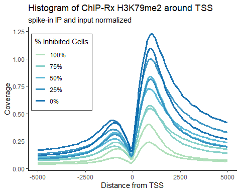
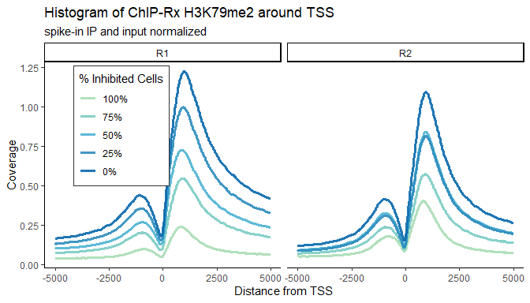
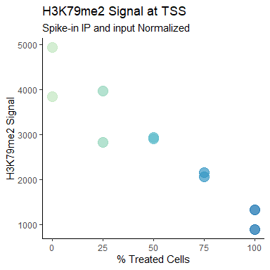
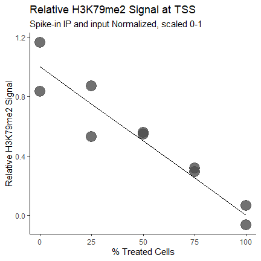

spike_correspondence_figure1a
================

- <a href="#orlando-et-al-chip-rx-titration-of-h3k79me2"
  id="toc-orlando-et-al-chip-rx-titration-of-h3k79me2">Orlando et al:
  ChIP-Rx Titration of H3K79me2</a>
  - <a href="#getting-.fastq-files" id="toc-getting-.fastq-files">Getting
    .FASTQ Files</a>
  - <a href="#alignment-.fastq---.sam"
    id="toc-alignment-.fastq---.sam">Alignment: .FASTQ -&gt; .SAM</a>
    - <a href="#genome-preparation" id="toc-genome-preparation">Genome
      Preparation:</a>
  - <a href="#remove-pcr-duplicates" id="toc-remove-pcr-duplicates">Remove
    PCR Duplicates</a>
  - <a href="#separate-alignment-file-into-species-specific-alignments"
    id="toc-separate-alignment-file-into-species-specific-alignments">Separate
    Alignment File into Species-specific Alignments</a>
  - <a href="#make-homer-tag-directories"
    id="toc-make-homer-tag-directories">Make HOMER Tag Directories</a>
  - <a href="#visualize-with-bigwigs"
    id="toc-visualize-with-bigwigs">Visualize with BigWigs</a>
  - <a href="#determine-normalization-factor"
    id="toc-determine-normalization-factor">Determine Normalization
    Factor</a>
  - <a href="#analysis-with-homer" id="toc-analysis-with-homer">Analysis
    with HOMER</a>
    - <a href="#histograms-at-tss" id="toc-histograms-at-tss">Histograms at
      TSS</a>
    - <a href="#peak-finding" id="toc-peak-finding">Peak Finding</a>
    - <a href="#quantification-at-peaks"
      id="toc-quantification-at-peaks">Quantification at Peaks</a>
  - <a href="#normalization" id="toc-normalization">Normalization</a>
    - <a href="#import-sequencing-statistics-file"
      id="toc-import-sequencing-statistics-file">import sequencing statistics
      file</a>
    - <a href="#histogram-of-h3k79me2-around-tss"
      id="toc-histogram-of-h3k79me2-around-tss">Histogram of H3K79me2 around
      TSS</a>
  - <a href="#normalize-to-spike-in-ip-and-inputs"
    id="toc-normalize-to-spike-in-ip-and-inputs">Normalize to spike-in IP
    and inputs</a>
  - <a href="#normalize-to-spike-in-ip-and-inputs-1"
    id="toc-normalize-to-spike-in-ip-and-inputs-1">normalize to spike-in IP
    and inputs</a>
    - <a href="#quantify-signal" id="toc-quantify-signal">Quantify signal</a>
    - <a href="#scale-points-from-0-1" id="toc-scale-points-from-0-1">Scale
      points from 0-1</a>
    - <a href="#make-line-of-expected-signal"
      id="toc-make-line-of-expected-signal">Make line of expected signal:</a>
    - <a href="#add-replicates" id="toc-add-replicates">Add replicates</a>

``` r
library(tidyverse)
```

    Warning: package 'ggplot2' was built under R version 4.3.3

    Warning: package 'lubridate' was built under R version 4.3.2

    ── Attaching core tidyverse packages ──────────────────────── tidyverse 2.0.0 ──
    ✔ dplyr     1.1.3     ✔ readr     2.1.4
    ✔ forcats   1.0.0     ✔ stringr   1.5.1
    ✔ ggplot2   3.5.1     ✔ tibble    3.2.1
    ✔ lubridate 1.9.3     ✔ tidyr     1.3.0
    ✔ purrr     1.0.2     
    ── Conflicts ────────────────────────────────────────── tidyverse_conflicts() ──
    ✖ dplyr::filter() masks stats::filter()
    ✖ dplyr::lag()    masks stats::lag()
    ℹ Use the conflicted package (<http://conflicted.r-lib.org/>) to force all conflicts to become errors

# Orlando et al: ChIP-Rx Titration of H3K79me2

## Getting .FASTQ Files

Downloaded with SRA Toolkit 3.0.5

SRA Numbers: <br> SRR1584489: Replicate 1 input, 0_inhib <br>
SRR1584490: Replicate 1 input, 25_inhib <br> SRR1584491: Replicate 1
input, 50_inhib <br> SRR1584492: Replicate 1 input, 75_inhib <br>
SRR1584493: Replicate 1 input, 100_inhib <br> SRR1584494: Replicate 2
input, 0_inhib <br> SRR1584495: Replicate 2 input, 25_inhib <br>
SRR1584496: Replicate 2 input, 50_inhib <br> SRR1584497: Replicate 2
input, 75_inhib <br> SRR1584498: Replicate 2 input, 100_inhib <br>

``` bash
fasterq-dump --skip-technical --split-3 SRR#######
```

## Alignment: .FASTQ -\> .SAM

### Genome Preparation:

Genomes Downloaded with HOMER: hg38, dm6

``` bash
perl /path/to/homer/configureHomer.pl -list
# lists genomes preconfigured with HOMER, if listed can run below commands to install

perl /gpfs/data01/bennerlab/path/to/homer/configureHomer.pl -install hg38

perl /gpfs/data01/bennerlab/path/to/homer/configureHomer.pl -install dm6
```

Add chromosome suffixes to identify spike-in chromosomes

``` bash
## Fly dm6 Genome
# suffix added "_dm6"
sed 's/>.*/&_dm6/' genome.fa > genome_dm6.fa

# check by printing fastq headers
perl -ne 'if(/^>(\S+)/){print "$1\n"}' genome_dm6.fa
```

Combine spike-in/target genomes:

``` bash
cat ${dir}/dm6/genome_dm6.fa ${dir}/hg38/genome.fa > genome_hg38_dm6.fa
```

Index genome:

``` bash
bwa index -p genome_prefix ${file}.fa
```

Alignment:

``` bash
bwa mem -t 4 ~/data/genome_index/genome_prefix ${file}.fastq > ${file}.sam
```

## Remove PCR Duplicates

``` bash
# single end reads: don't need to collate
# fixmate can go from sam to bam 
samtools fixmate -m ${file}.sam ${file}.fixmate.bam
samtools sort ${file}.fixmate.bam -o ${file}.sorted.bam
samtools markdup -r -s ${file}.sorted.bam ${file}.nodup.bam
```

## Separate Alignment File into Species-specific Alignments

Split alignment file into files for each chromosome

``` bash
bam splitChromosome --in ${file}.nodup.bam --out ${file}.
```

Remove *chrUn*, *random* files

Merge chromosome files to get one alignment file per species. Need to
merge spike-in species first, then remove those chromosomes

``` bash
# create spike-in alignment file
samtools merge ${file}.dm6.bam ${file}.chr*_dm6.bam

# remove spike-in chromosome files
rm ${file}.chr*_dm6.bam

# create target alignment file
samtools merge ${file}.hg38.bam ${file}.chr*.bam
```

Convert BAM to SAM (-h to keep header), remove suffixes from files with
sed.

``` bash
samtools view -h ${file}.bam | sed -e 's/\_dm6//g' > ${file}.nosuffix.sam
```

## Make HOMER Tag Directories

By default, HOMER `makeTagDirectory` or `batchMakeTagDirectory` only
keep primary alignments with MAPQ \> 10. Tag directories are also
read-depth normalized to 10 million reads unless otherwise specified. To
create Tag Directories in batch mode, first create a tsv file called a
tagkey, containing the names for each input file and each desired output
tag directory.

Format of the tagkey file: TSV <br> file1-tagdir file1.nosuffix.sam <br>
file2-tagdir file2.nosuffix.sam <br> file3-tagdir file3.nosuffix.sam
<br>

Then run HOMER `batchMakeTagDirectory.pl` for each species. Example with
hg38:

``` bash
batchMakeTagDirectory.pl tagkey -genome hg38 -cpu 8 -fragLength 150
```

## Visualize with BigWigs

Can make BigWigs from bam file with Deeptools, or from Tag Directories
with HOMER `makeBigWig.pl`

``` bash
makeBigWig.pl ${file}-tagdir/ hg38 -webdir /path/to/webdirectory -url http://webdirectoryurl/
```

## Determine Normalization Factor

## Analysis with HOMER

### Histograms at TSS

Recommended parameters for H3K79me2: Make histogram of size 10kb
centered at TSS, with bin size 25bp.

``` bash
annotatePeaks.pl tss hg38 -size 10000 -hist 25 -d ${file}1-tagdir ${file}2-tagdir > histogram_tss_hg38_samples.txt
```

### Peak Finding

Recommended parameters for histone mark peak finding: -style histone,
-size 1000, -minDist 2500

``` bash
findPeaks.pl ${file}-tagdir -style histone -size 1000 -minDist 2500 -i ${file}-input-tagdir > ${file}.regions.txt
```

### Quantification at Peaks

``` bash
annotatePeaks.pl ${file}.regions.txt -size 1000 -d ${file1}-tagdir ${file2}-tagdir > counts_regions_1kb_samples.txt
```

## Normalization

``` r
library(tidyverse)
library(RColorBrewer)
theme_set(theme_classic())
library(DescTools) ## need for calculating AUC
```

    Warning: package 'DescTools' was built under R version 4.3.3

### import sequencing statistics file

``` r
chiprx_stats <- read_excel("my_chiprx_stats.xlsx")
```

``` r
colnames(my_chiprx_stats)[3] <- "Percent_Cells_Inhibited"
colnames(my_chiprx_stats)[4] <- "Raw_reads"
colnames(my_chiprx_stats)[5] <- "Human_aligned"
colnames(my_chiprx_stats)[6] <- "Fly_aligned"
colnames(my_chiprx_stats)[7] <- "Read_norm_factor"
colnames(my_chiprx_stats)[8] <- "Fly_norm_factor"
```

### Histogram of H3K79me2 around TSS

Import data:

``` r
hist_tss_hg38_ChIPRx <- read.delim("~/Research/ChIP-Rx/hist_tss_hg38_10kb_ChIPRx.txt")
```

My sample names are named by the convention:
Jurkat_K79_0\_R1_H3K79me2.dual.hg38-tagdir

Each sample has 3 columns: Coverage:
Jurkat_K79_0\_R1_H3K79me2.dual.hg38- <br> Plus Strand Tags:
Jurkat_K79_0\_R1_H3K79me2.dual.hg38-tagdir…Tags <br> Minus Strand Tags:
Jurkat_K79_0\_R1_H3K79me2.dual.hg38-tagdir…Tags.1 <br>

The first column currently contains the command used to generate the
histogram TSV file. To process the histogram file for easier plotting, I
modify column names, convert to tidyR format, then split the file name
into columns for each treatment condition/replicate/etc.

``` r
process_histograms <- function(x, .x) {
    colnames(x)[1] <- "Distance_from_tss"
    x <- x %>% 
    rename_with(~ gsub(".dual.hg38.tagdir", "", .x), contains("tagdir")) %>% 
    rename_with(~ gsub("Jurkat_", "", .x), contains("Jurkat")) %>%
    rename_with(~ gsub("\\.[[:digit:]]$", "_minus", .x), contains("Tags")) %>% 
    rename_with(~ gsub("\\.\\.\\.", "_", .x), contains("Tags"))
    
    xcov <- x %>% select(contains("Coverage"))
    xcov$Distance_from_tss <- x$Distance_from_tss
    
    xcovlong <- 
    xcov %>% pivot_longer(
      cols = -"Distance_from_tss", 
      names_to = "Sample", 
      values_to = "Coverage")
  }
```

Get in tidy format

``` r
hist_tss_hg38_ChIPRx_tidy <- process_histograms(hist_tss_hg38_ChIPRx)
```

Split by regex: split sample names into multiple columns `mark`,
`inhibition`, `replicate`, and `antibody`

``` r
# when debugging, add too_few = "debug" as last argument in separate_wider_regex()

hist_tss_hg38_ChIPRx_sep <- hist_tss_hg38_ChIPRx_tidy %>% separate_wider_regex(cols = Sample, patterns = c(
  mark = ".+",
  "\\_", 
  inhibition = ".+", 
  "\\_", 
  replicate = ".+", 
  "\\_", 
  antibody = ".+", 
  ".Coverage"))
```

Column inhibition describes the % of Jurkat cells treated with DOT1
inhibitor. Need to set this variable as a factor, and specify the order
explicitly.

``` r
hist_tss_hg38_ChIPRx_sep$inhibition <- factor(hist_tss_hg38_ChIPRx_sep$inhibition,levels = c("100", "75", "50", "25", "0"))
```

#### Read normalized plotting

Also in Supplemental Figures.

``` r
ggplot(data = hist_tss_hg38_ChIPRx_sep) + 
  aes(x = Distance_from_tss, y = Coverage, group = interaction(inhibition, replicate), color = inhibition) +
  geom_line(linewidth = 1.1, alpha = 0.9) + 
  labs(title = "Histogram of ChIP-Rx H3K79me2 around TSS", 
       subtitle = "read depth normalized", 
       x = "Distance from TSS") + 
  scale_color_manual(values = colorRampPalette(brewer.pal(9, "GnBu"))(9)[4:9], 
                      name = "% Inhibited Cells", 
                     labels = c("100%", "75%", "50%", "25%", "0%")) + 
   theme(legend.position = c(0.2, 0.7), 
                          legend.background = element_rect(
                                  linewidth=0.7, linetype="solid", 
                                  colour ="grey20")) 
```

    Warning: A numeric `legend.position` argument in `theme()` was deprecated in ggplot2
    3.5.0.
    ℹ Please use the `legend.position.inside` argument of `theme()` instead.



#### Quantify Signal: Fig 1a, left

``` r
samples <- unique(hist_tss_hg38_ChIPRx_tidy$Sample)

colnames(hist_tss_hg38_ChIPRx)[1] <- "Distance_from_tss"

x <- hist_tss_hg38_ChIPRx$Distance_from_tss

AUC_peaks <- matrix(data = "", nrow = length(samples), ncol = 1)
AUC_peaks <- data.frame(AUC_peaks, row.names = samples)

for (i in 1:length(samples)) {

  y <- hist_tss_hg38_ChIPRx_tidy %>% 
    filter(Sample == samples[i]) %>%
    select(Coverage)
  y <- pull(y, Coverage)

AUC_peaks[i, ] <- AUC(x, y, method = c("trapezoid"))

}
```

``` r
AUC_peaks$AUC_peaks <- as.numeric(AUC_peaks$AUC_peaks)

percent_treated <- rep(c(0, 100, 25, 50, 75), each = 2)
AUC_peaks$percent_treated <- as.numeric(percent_treated)
```

``` r
AUC_peaks %>%
 ggplot(aes(x = percent_treated, y = AUC_peaks)) +
  geom_point(size = 5, alpha = 0.7, color = "grey30", stroke = NA) +
  scale_color_manual(
    name = "% Inhibited Cells", 
    labels = c("0%", "25%", "50%", "75%", "100%"))  + 
  theme_classic() + 
  labs(title = "H3K79me2 Signal at TSS", 
       subtitle = "Read-Depth Normalized",
       x = "% Treated Cells", 
       y = "H3K79me2 Signal")  + 
  theme(legend.position = "none")
```



Scale points from 0-1

``` r
avg_0treated <- mean(c(AUC_peaks[1,1], AUC_peaks[2,1]))
avg_100treated <- mean(c(AUC_peaks[3,1], AUC_peaks[4,1]))
avg_25treated <- mean(c(AUC_peaks[5,1], AUC_peaks[6,1]))
avg_50treated <- mean(c(AUC_peaks[7,1], AUC_peaks[8,1]))
avg_75treated <- mean(c(AUC_peaks[9,1], AUC_peaks[10,1]))
```

``` r
AUC_peaks <- AUC_peaks %>%
  mutate(minmaxnorm = (AUC_peaks-avg_100treated)/(avg_0treated-avg_100treated) )
```

``` r
minmaxnorm_avg_0treated <- mean(c(AUC_peaks[1,3], AUC_peaks[2,3]))
minmaxnorm_avg_100treated <- mean(c(AUC_peaks[3,3], AUC_peaks[4,3]))
minmaxnorm_avg_25treated <- mean(c(AUC_peaks[5,3], AUC_peaks[6,3]))
minmaxnorm_avg_50treated <- mean(c(AUC_peaks[7,3], AUC_peaks[8,3]))
minmaxnorm_avg_75treated <- mean(c(AUC_peaks[9,3], AUC_peaks[10,3]))
```

Make line of expected signal:

``` r
observed_line <- c(minmaxnorm_avg_100treated, minmaxnorm_avg_75treated, minmaxnorm_avg_50treated, minmaxnorm_avg_25treated, minmaxnorm_avg_0treated)

expected_line <- c(0, 0.25, 0.5, 0.75, 1)

percent_treated_mean <- rep(c(100, 75, 50, 25, 0))

observed_vs_expected <- data.frame(cbind(percent_treated_mean, expected_line, observed_line))
```

``` r
ggplot() +
  geom_point(data = AUC_peaks, 
             aes(x = as.numeric(percent_treated), y = minmaxnorm), color = "grey30", size = 6, alpha = 0.8) + 
  geom_line(data = observed_vs_expected, 
            aes(x = as.numeric(percent_treated_mean), y = expected_line)) +
 labs(title = "Relative H3K79me2 Signal at TSS", 
       subtitle = "Read Normalized, scaled 0-1",
       x = "% Treated Cells", 
       y = "Relative H3K79me2 Signal") + 
  theme(legend.position = "none")
```



#### Calculated Rsquared

``` r
get_Rsquared <- function(AUC_peaks) {
  AUC_peaks$expected <- rep(c(1, 0, 0.75, 0.5, 0.25), each = 2)
  
  AUC_peaks$error <- AUC_peaks$minmaxnorm - AUC_peaks$expected
  
  mse = sum(((AUC_peaks$error)^2)/3)
  
  SSres = sum((AUC_peaks$error)^2)
  meanobserved <- mean(AUC_peaks$minmaxnorm)
  SStotal = sum((AUC_peaks$minmaxnorm-meanobserved)^2)
  rsquared = 1 - (SSres/SStotal)
  rsquared
}
```

``` r
get_Rsquared(AUC_peaks)
```

    [1] 0.430456

## Normalize to spike-in IP and inputs

``` r
process_histograms_cov <- function(x, .x) {
    colnames(x)[1] <- "Distance_from_tss"
    x <- x %>% 
    rename_with(~ gsub(".dual.hg38.tagdir", "", .x), contains("tagdir")) %>% 
    rename_with(~ gsub("Jurkat_", "", .x), contains("Jurkat")) %>%
    rename_with(~ gsub("\\.[[:digit:]]$", "_minus", .x), contains("Tags")) %>% 
    rename_with(~ gsub("\\.\\.\\.", "_", .x), contains("Tags"))
    
    xcov <- x %>% select(contains("Coverage"))
}
```

``` r
colnames(hist_tss_hg38_ChIPRx)[1] <- "Distance_from_tss"

hist_tss_hg38_ChIPRx_cov <- process_histograms_cov(hist_tss_hg38_ChIPRx)

hist_tss_hg38_ChIPRx_cov$Distance_from_tss <- hist_tss_hg38_ChIPRx$Distance_from_tss
```

ChIP-Rx normalization formula:

Normalization factor = (1/Fly reads)\*1000000

## normalize to spike-in IP and inputs

``` r
chiprx_fly_ipinput_norm <- hist_tss_hg38_ChIPRx_cov

chiprx_fly_ipinput_norm$K79_0_R1_H3K79me2.Coverage <- 
  hist_tss_hg38_ChIPRx_cov$K79_0_R1_H3K79me2.Coverage*(1/5.321795)*(1.3450)
chiprx_fly_ipinput_norm$K79_0_R2_H3K79me2.Coverage <- 
  hist_tss_hg38_ChIPRx_cov$K79_0_R2_H3K79me2.Coverage*(1/6.174764)*(1.1639)

chiprx_fly_ipinput_norm$K79_25_R1_H3K79me2.Coverage <- 
  hist_tss_hg38_ChIPRx_cov$K79_25_R1_H3K79me2.Coverage*(1/6.148836)*(1.1957)
chiprx_fly_ipinput_norm$K79_25_R2_H3K79me2.Coverage <- 
  hist_tss_hg38_ChIPRx_cov$K79_25_R2_H3K79me2.Coverage*(1/8.119575)*(1.1165)

chiprx_fly_ipinput_norm$K79_50_R1_H3K79me2.Coverage <- 
  hist_tss_hg38_ChIPRx_cov$K79_50_R1_H3K79me2.Coverage*(1/7.059974)*(1.1198)
chiprx_fly_ipinput_norm$K79_50_R2_H3K79me2.Coverage <- 
  hist_tss_hg38_ChIPRx_cov$K79_50_R2_H3K79me2.Coverage*(1/8.962803)*(1.3628)

chiprx_fly_ipinput_norm$K79_75_R1_H3K79me2.Coverage <- 
  hist_tss_hg38_ChIPRx_cov$K79_75_R1_H3K79me2.Coverage*(1/8.449487)*(1.0000)
chiprx_fly_ipinput_norm$K79_75_R2_H3K79me2.Coverage <- 
  hist_tss_hg38_ChIPRx_cov$K79_75_R2_H3K79me2.Coverage*(1/10.323964)*(1.3824)

chiprx_fly_ipinput_norm$K79_100_R1_H3K79me2.Coverage <- 
  hist_tss_hg38_ChIPRx_cov$K79_100_R1_H3K79me2.Coverage*(1/14.655924)*(1.3777)
chiprx_fly_ipinput_norm$K79_100_R2_H3K79me2.Coverage <- 
  hist_tss_hg38_ChIPRx_cov$K79_100_R2_H3K79me2.Coverage*(1/8.891320)*(1.0000)
```

``` r
chiprx_fly_ipinput_norm_tidy <- chiprx_fly_ipinput_norm %>% pivot_longer(cols = -"Distance_from_tss", names_to = "Sample", values_to = "Coverage")
#head(hist_tss_hg38_cov_tidy)
```

``` r
chiprx_fly_ipinput_norm_tidy_sep <- chiprx_fly_ipinput_norm_tidy %>% separate_wider_regex(cols = Sample, patterns = c(
  mark = ".+",
  "\\_", 
  inhibition = ".+", 
  "\\_", 
  replicate = ".+", 
  "\\_", 
  antibody = ".+", 
  ".Coverage"))
```

``` r
chiprx_fly_ipinput_norm_tidy_sep$inhibition <- factor(chiprx_fly_ipinput_norm_tidy_sep$inhibition,levels = c("100", "75", "50", "25", "0"))
```

``` r
ggplot(data = chiprx_fly_ipinput_norm_tidy_sep) + 
  aes(x = Distance_from_tss, y = Coverage, group = interaction(inhibition, replicate), color = inhibition) +
  geom_line(linewidth = 1.2, alpha = 0.9) + 
  labs(title = "Histogram of ChIP-Rx H3K79me2 around TSS", 
       subtitle = "spike-in IP and input normalized", 
       x = "Distance from TSS") + 
  scale_color_manual(values = colorRampPalette(brewer.pal(9, "GnBu"))(9)[4:9], 
                      name = "% Inhibited Cells", 
                     labels = c("100%", "75%", "50%", "25%", "0%")) + 
   theme(legend.position = c(0.16, 0.69), 
                          legend.background = element_rect(
                                  size=0.7, linetype="solid", 
                                  colour ="grey20"))
```

    Warning: The `size` argument of `element_rect()` is deprecated as of ggplot2 3.4.0.
    ℹ Please use the `linewidth` argument instead.



``` r
ggplot(data = chiprx_fly_ipinput_norm_tidy_sep) + 
  aes(x = Distance_from_tss, y = Coverage, group = interaction(inhibition, replicate), color = inhibition) +
  geom_line(linewidth = 1.2, alpha = 0.9) + 
  labs(title = "Histogram of ChIP-Rx H3K79me2 around TSS", 
       subtitle = "spike-in IP and input normalized", 
       x = "Distance from TSS") + 
  scale_color_manual(values = colorRampPalette(brewer.pal(9, "GnBu"))(9)[4:9], 
                      name = "% Inhibited Cells", 
                     labels = c("100%", "75%", "50%", "25%", "0%")) + 
   theme(legend.position = c(0.16, 0.69), 
                          legend.background = element_rect(
                                  size=0.7, linetype="solid", 
                                  colour ="grey20")) +
  facet_wrap(~ replicate)
```



### Quantify signal

``` r
samples <- unique(chiprx_fly_ipinput_norm_tidy$Sample)

colnames(hist_tss_hg38_ChIPRx)[1] <- "Distance_from_tss"

x <- hist_tss_hg38_ChIPRx$Distance_from_tss

AUC_peaks <- matrix(data = "", nrow = length(samples), ncol = 1)
AUC_peaks <- data.frame(AUC_peaks, row.names = samples)

for (i in 1:length(samples)) {

  y <- chiprx_fly_ipinput_norm_tidy %>% 
    filter(Sample == samples[i]) %>%
    select(Coverage)
  y <- pull(y, Coverage)

AUC_peaks[i, ] <- AUC(x, y, method = c("trapezoid"))

}
```

``` r
AUC_peaks$AUC_peaks <- as.numeric(AUC_peaks$AUC_peaks)

percent_treated <- rep(c(0, 100, 25, 50, 75), each = 2)
AUC_peaks$percent_treated <- as.numeric(percent_treated)
```

``` r
AUC_peaks %>%
 ggplot(aes(x = percent_treated, y = AUC_peaks, color = as.factor(percent_treated))) +
  geom_point(size = 5, alpha = 0.7) +
  scale_color_manual(
    values = colorRampPalette(brewer.pal(9, "GnBu"))(8)[3:8],
    name = "% Inhibited Cells", 
    labels = c("0%", "25%", "50%", "75%", "100%"))  + 
  theme_classic() + 
  labs(title = "H3K79me2 Signal at TSS", 
       subtitle = "Spike-in IP and input Normalized",
       x = "% Treated Cells", 
       y = "H3K79me2 Signal")  + 
  theme(legend.position = "none")
```



### Scale points from 0-1

``` r
avg_0treated <- mean(c(AUC_peaks[1,1], AUC_peaks[2,1]))
avg_100treated <- mean(c(AUC_peaks[3,1], AUC_peaks[4,1]))
avg_25treated <- mean(c(AUC_peaks[5,1], AUC_peaks[6,1]))
avg_50treated <- mean(c(AUC_peaks[7,1], AUC_peaks[8,1]))
avg_75treated <- mean(c(AUC_peaks[9,1], AUC_peaks[10,1]))
```

``` r
AUC_peaks <- AUC_peaks %>%
  mutate(minmaxnorm = (AUC_peaks-avg_100treated)/(avg_0treated-avg_100treated) )
```

``` r
minmaxnorm_avg_0treated <- mean(c(AUC_peaks[1,3], AUC_peaks[2,3]))
minmaxnorm_avg_100treated <- mean(c(AUC_peaks[3,3], AUC_peaks[4,3]))
minmaxnorm_avg_25treated <- mean(c(AUC_peaks[5,3], AUC_peaks[6,3]))
minmaxnorm_avg_50treated <- mean(c(AUC_peaks[7,3], AUC_peaks[8,3]))
minmaxnorm_avg_75treated <- mean(c(AUC_peaks[9,3], AUC_peaks[10,3]))
```

### Make line of expected signal:

``` r
observed_line <- c(minmaxnorm_avg_100treated, minmaxnorm_avg_75treated, minmaxnorm_avg_50treated, minmaxnorm_avg_25treated, minmaxnorm_avg_0treated)

expected_line <- c(0, 0.25, 0.5, 0.75, 1)

percent_treated_mean <- rep(c(100, 75, 50, 25, 0))

observed_vs_expected <- data.frame(cbind(percent_treated_mean, expected_line, observed_line))
```

``` r
get_Rsquared(AUC_peaks)
```

    [1] 0.8909891

### Add replicates

``` r
ggplot() +
  geom_point(data = AUC_peaks, 
             aes(x = as.numeric(percent_treated), y = minmaxnorm), 
             size = 6, color = "grey30", alpha = 0.8) + 
  scale_color_manual(values = colorRampPalette(brewer.pal(9, "GnBu"))(9)[4:9], 
                      name = "% Inhibited Cells", 
                     labels = c("100%", "75%", "50%", "25%", "0%")) +
  geom_line(data = observed_vs_expected, 
            aes(x = as.numeric(percent_treated_mean), y = expected_line)) +
 labs(title = "Relative H3K79me2 Signal at TSS", 
       subtitle = "Spike-in IP and input Normalized, scaled 0-1",
       x = "% Treated Cells", 
       y = "Relative H3K79me2 Signal") + 
  theme(legend.position = "none")
```


