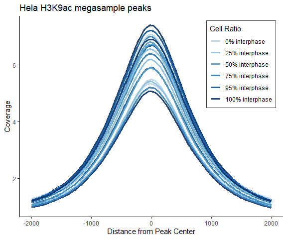
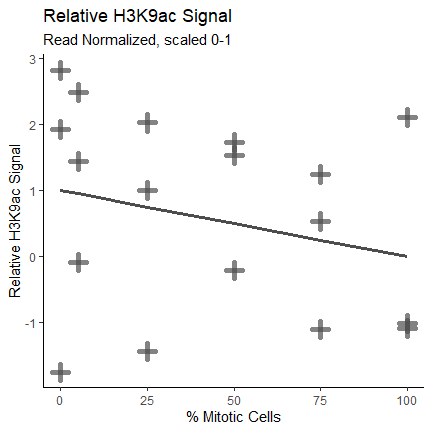
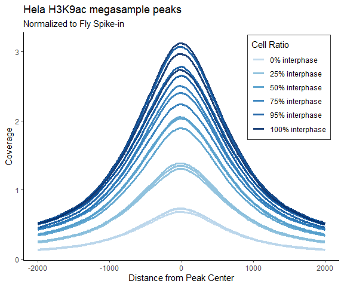
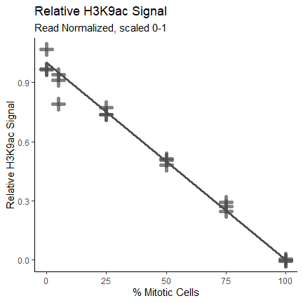

spike_correspondence_figure1b
================

- <a href="#our-dataset" id="toc-our-dataset">Our dataset</a>
  - <a href="#trimming-.fastq-files" id="toc-trimming-.fastq-files">Trimming
    .FASTQ Files</a>
  - <a href="#alignment-.fastq---.sam"
    id="toc-alignment-.fastq---.sam">Alignment: .FASTQ -&gt; .SAM</a>
    - <a href="#genome-preparation" id="toc-genome-preparation">Genome
      Preparation:</a>
  - <a href="#remove-pcr-duplicates" id="toc-remove-pcr-duplicates">Remove
    PCR Duplicates</a>
  - <a href="#separate-alignment-file-into-species-specific-alignments"
    id="toc-separate-alignment-file-into-species-specific-alignments">Separate
    Alignment File into Species-specific Alignments</a>
  - <a href="#make-homer-tag-directories"
    id="toc-make-homer-tag-directories">Make HOMER Tag Directories</a>
  - <a href="#visualize-with-bigwigs"
    id="toc-visualize-with-bigwigs">Visualize with BigWigs</a>
  - <a href="#determine-normalization-factor"
    id="toc-determine-normalization-factor">Determine Normalization
    Factor</a>
  - <a href="#analysis-with-homer" id="toc-analysis-with-homer">Analysis
    with HOMER</a>
    - <a href="#histograms-at-tss" id="toc-histograms-at-tss">Histograms at
      TSS</a>
    - <a href="#peak-finding" id="toc-peak-finding">Peak Finding</a>
    - <a href="#quantification-at-peaks"
      id="toc-quantification-at-peaks">Quantification at Peaks</a>
  - <a href="#megapeak-get-h3k9ac-regions-to-quantify-signal"
    id="toc-megapeak-get-h3k9ac-regions-to-quantify-signal">Megapeak: Get
    H3K9ac regions to quantify signal</a>
- <a href="#import-histogram-data" id="toc-import-histogram-data">Import
  histogram data</a>
  - <a href="#calculate-signal-at-peaks-area-under-histogram-curve"
    id="toc-calculate-signal-at-peaks-area-under-histogram-curve">Calculate
    Signal at Peaks: Area under Histogram Curve</a>
  - <a href="#make-line-of-expected-signal"
    id="toc-make-line-of-expected-signal">Make line of expected signal:</a>
  - <a href="#plot-read-normalized-signal-vs-expected-signal-fig-1b"
    id="toc-plot-read-normalized-signal-vs-expected-signal-fig-1b">Plot Read
    normalized signal vs expected signal: Fig 1b</a>
- <a href="#normalize-peak-signal"
  id="toc-normalize-peak-signal">Normalize peak signal</a>
  - <a href="#average-yeast-and-fly-inputip"
    id="toc-average-yeast-and-fly-inputip">Average yeast and fly
    input/IP</a>
    - <a href="#determine-normalization-factor-from-aligned-reads"
      id="toc-determine-normalization-factor-from-aligned-reads">Determine
      normalization factor from aligned reads:</a>
    - <a href="#calculate-signal-at-peaks-area-under-histogram-curve-1"
      id="toc-calculate-signal-at-peaks-area-under-histogram-curve-1">Calculate
      Signal at Peaks: Area under Histogram Curve</a>
    - <a href="#make-line-of-expected-signal-1"
      id="toc-make-line-of-expected-signal-1">Make line of expected
      signal:</a>
    - <a href="#plot-read-normalized-signal-vs-expected-signal-fig-1b-1"
      id="toc-plot-read-normalized-signal-vs-expected-signal-fig-1b-1">Plot
      Read normalized signal vs expected signal: Fig 1b</a>

``` r
library(tidyverse)
```

    Warning: package 'ggplot2' was built under R version 4.3.3

    Warning: package 'lubridate' was built under R version 4.3.2

    ── Attaching core tidyverse packages ──────────────────────── tidyverse 2.0.0 ──
    ✔ dplyr     1.1.3     ✔ readr     2.1.4
    ✔ forcats   1.0.0     ✔ stringr   1.5.1
    ✔ ggplot2   3.5.1     ✔ tibble    3.2.1
    ✔ lubridate 1.9.3     ✔ tidyr     1.3.0
    ✔ purrr     1.0.2     
    ── Conflicts ────────────────────────────────────────── tidyverse_conflicts() ──
    ✖ dplyr::filter() masks stats::filter()
    ✖ dplyr::lag()    masks stats::lag()
    ℹ Use the conflicted package (<http://conflicted.r-lib.org/>) to force all conflicts to become errors

``` r
library(RColorBrewer)
theme_set(theme_classic())
library(DescTools)
```

    Warning: package 'DescTools' was built under R version 4.3.3

# Our dataset

Sequenced on NextSeq 550, demultiplexed with Illumina bcl2fastq

## Trimming .FASTQ Files

``` bash
base=$(basename $i _R1_001.fastq.gz)
trimmomatic SE ${base}_R1_001.fastq.gz ${dir}/${base}.trim.fastq.gz \
-threads 8 \
ILLUMINACLIP:/trimmomatic-0.39-hdfd78af_2/share/trimmomatic-0.39-2/adapters/TruSeq3-SE.fa:2:30:7 \
LEADING:3 TRAILING:3 SLIDINGWINDOW:4:20 MINLEN:36
```

## Alignment: .FASTQ -\> .SAM

### Genome Preparation:

Genomes Downloaded with HOMER: hg38, dm6, sacCer3

``` bash
perl /gpfs/data01/bennerlab/path/to/homer/configureHomer.pl -install hg38

perl /gpfs/data01/bennerlab/path/to/homer/configureHomer.pl -install dm6

perl /gpfs/data01/bennerlab/path/to/homer/configureHomer.pl -install sacCer3
```

Add chromosome suffixes to identify spike-in chromosomes

Fasta file of genome location: /homer/data/genomes/hg38/genome.fa

``` bash
## Fly dm6 Genome
# suffix added "_dm6"
sed 's/>.*/&_dm6/' genome.fa > genome_dm6.fa

# check by printing fastq headers
perl -ne 'if(/^>(\S+)/){print "$1\n"}' genome_dm6.fa

## Yeast sacCer3 Genome
# suffix added "_sac3"
sed 's/>.*/&_sac3/' genome.fa > genome_sac3.fa

# check by printing fastq headers
perl -ne 'if(/^>(\S+)/){print "$1\n"}' genome_sac3.fa
```

Combine spike-in/target genomes:

``` bash
cat ${dir}/dm6/genome_dm6.fa ${dir}/sacCer3/genome_sac3.fa ${dir}/hg38/genome.fa > genome_hg38_dm6_sac3.fa
```

Index genome:

``` bash
bwa index -p hg38_dm6_sac3 genome_hg38_dm6_sac3.fa
```

Alignment:

``` bash
bwa mem -t 4 ~/data/genome_index/genome_prefix ${file}.fastq > ${file}.sam
```

## Remove PCR Duplicates

``` bash
# single end reads: don't need to collate
# fixmate can go from sam to bam 
samtools fixmate -m ${file}.sam ${file}.fixmate.bam
samtools sort ${file}.fixmate.bam -o ${file}.sorted.bam
samtools markdup -r -s ${file}.sorted.bam ${file}.nodup.bam
```

## Separate Alignment File into Species-specific Alignments

Split alignment file into files for each chromosome

``` bash
bam splitChromosome --in ${file}.nodup.bam --out ${file}.
```

Remove *chrUn*, *random* files

Merge chromosome files to get one alignment file per species. Need to
merge spike-in species first, then remove those chromosomes

``` bash
# create dm6 spike-in alignment file
samtools merge ${file}.dm6.bam ${file}.chr*_dm6.bam

# remove dm6 spike-in chromosome files
rm ${file}.chr*_dm6.bam

# create sac3 spike-in alignment file
samtools merge ${file}.sac3.bam ${file}.chr*_sac3.bam

# remove sac3 spike-in chromosome files
rm ${file}.chr*_sac3.bam

# create target alignment file
samtools merge ${file}.hg38.bam ${file}.chr*.bam
```

Convert BAM to SAM (-h to keep header), remove suffixes from files with
sed.

``` bash
# remove first set of spike-in suffixes
samtools view -h ${file}.bam | sed -e 's/\_dm6//g' > ${file}.nosuffix.sam

# remove second set of spike-in suffixes
samtools view -h ${file}.nosuffix.sam | sed -e 's/\_sac3//g' > ${file}.nosuffix2.sam
```

## Make HOMER Tag Directories

By default, HOMER `makeTagDirectory` or `batchMakeTagDirectory` only
keep primary alignments with MAPQ \> 10. Tag directories are also
read-depth normalized to 10 million reads unless otherwise specified. To
create Tag Directories in batch mode, first create a tsv file called a
tagkey, containing the names for each input file and each desired output
tag directory.

Format of the tagkey file: TSV <br> file1-tagdir file1.nosuffix2.sam
<br> file2-tagdir file2.nosuffix2.sam <br> file3-tagdir
file3.nosuffix2.sam <br>

Then run HOMER `batchMakeTagDirectory.pl` for each species. Example with
hg38:

``` bash
batchMakeTagDirectory.pl tagkey -genome hg38 \
-cpu 8 -fragLength 150
```

Repeat for dm6, sacCer3 genomes

## Visualize with BigWigs

Can make BigWigs from bam file with Deeptools, or from Tag Directories
with HOMER `makeBigWig.pl`

``` bash
makeBigWig.pl ${file}-tagdir/ hg38 \
-webdir /path/to/webdirectory -url http://webdirectoryurl/
```

Note: you can also make BedGraphs with HOMER `makeBedGraph.pl`

Repeat for dm6, sacCer3 genomes

## Determine Normalization Factor

## Analysis with HOMER

### Histograms at TSS

Recommended parameters for H3K79me2: Make histogram of size 4kb centered
at TSS, with bin size 25bp.

``` bash
annotatePeaks.pl tss hg38 -size 4000 -hist 25 \
-d ${file}1-tagdir ${file}2-tagdir \
> histogram_tss_hg38_samples.txt
```

### Peak Finding

Recommended parameters for human histone mark peak finding: -style
histone, -size 1000, -minDist 2500. Note: yeast genome is
gene/acetylation dense, so if peak finding in yeast is desired,
paramters should be tweaked.

``` bash
findPeaks.pl ${file}-tagdir -style histone -size 1000 -minDist 2500 \
-i ${file}-input-tagdir > ${file}.regions.txt
```

### Quantification at Peaks

``` bash
annotatePeaks.pl ${file}.regions.txt -size 1000 \
-d ${file1}-tagdir ${file2}-tagdir > counts_regions_1kb_samples.txt
```

## Megapeak: Get H3K9ac regions to quantify signal

1.  Combined all samples to one “mega-ChIP-seq sample”, and all inputs
    to one “mega-input control”.
2.  Did peak finding with “mega ChIP-seq sample” with “mega-input
    control” as background. The overall increased read-depth of sample
    and input files will increase the tag threshold for peak finding,
    resulting in more significant peaks.
3.  Quantified H3K9ac signal at these peaks for every sample, making a
    histogram of size 4000 and bin size 25.

``` bash
findPeaks.pl ${file}.megasample-tagdir -style histone -size 1000 -minDist 2500 \
-i ${file}.megainput-tagdir > megasample_H3K9ac.regions.txt

annotatePeaks.pl megasample_H3K9ac.regions.txt hg38 -size 4000 -hist 25 \
-d ${file1}-tagdir ${file2}-tagdir ${file3}-tagdir .... > hist_K9ac_hg38_allsamples_LP78.txt
```

# Import histogram data

``` r
hist_K9ac_allsamples_LP78 <- read.delim("~/Research/LP_78/hist_K9ac_hg38_allsamples_LP78.txt")
```

``` r
process_my_histograms <- function(x, .x) {
    colnames(x)[1] <- "Distance_from_center"
    x <- x %>% 
    rename_with(~ gsub(".hg38.tagdir", "", .x), contains("tagdir")) %>% 
    rename_with(~ gsub(".+\\_Hela_", "HelaS3_", .x), contains("Hela")) %>%
      rename_with(~ gsub("ratio1", "100sync_0inter", .x), contains("ratio1")) %>%
      rename_with(~ gsub("ratio2", "75sync_25inter", .x), contains("ratio2")) %>%
      rename_with(~ gsub("ratio3", "50sync_50inter", .x), contains("ratio3")) %>%
      rename_with(~ gsub("ratio4", "25sync_75inter", .x), contains("ratio4")) %>%
      rename_with(~ gsub("ratio5", "5sync_95inter", .x), contains("ratio5")) %>%
      rename_with(~ gsub("ratio6", "0sync_100inter", .x), contains("ratio6")) %>%
      rename_with(~ gsub("K9ac", "H3K9ac", .x), contains("K9ac")) %>%
      rename_with(~ gsub("ac_r", "ac_rep", .x), contains("K9ac")) %>%
    rename_with(~ gsub("\\.[[:digit:]]$", "_minus", .x), contains("Tags")) %>% 
    rename_with(~ gsub("\\.\\.\\.", "_", .x), contains("Tags"))
    
    xcov <- x %>% select(contains("Coverage"))
    xcov$Distance_from_center <- x$Distance_from_center
    
    xcovlong <- 
    xcov %>% pivot_longer(
      cols = -"Distance_from_center", 
      names_to = "Sample", 
      values_to = "Coverage")
  }
```

``` r
hist_K9ac_allsamples_LP78_tidy <- 
  process_my_histograms(hist_K9ac_allsamples_LP78)
```

``` r
hist_K9ac_allsamples_LP78_sepIP <- hist_K9ac_allsamples_LP78_tidy[grep("K9ac", hist_K9ac_allsamples_LP78_tidy$Sample), ] %>% separate_wider_regex(cols = Sample, patterns = c(
  cell = ".+", 
  "\\_", 
  ratio_sync = "[:digit:]+", 
  "sync", "\\_", 
  ratio_inter = "[:digit:]+", 
  "inter", "\\_", 
  antibody = ".+", 
  "\\_", 
  replicate = ".+", 
  ".Coverage"))
```

Fix ordering of mitotic and interphase cell ratios:

``` r
hist_K9ac_allsamples_LP78_sepIP$ratio_sync <- factor(hist_K9ac_allsamples_LP78_sepIP$ratio_sync, levels = c(100, 75, 50, 25, 5, 0))

hist_K9ac_allsamples_LP78_sepIP$ratio_inter <- factor(hist_K9ac_allsamples_LP78_sepIP$ratio_inter, levels = c(0, 25, 50, 75, 95, 100))
```

``` r
ggplot(data = hist_K9ac_allsamples_LP78_sepIP) + 
  aes(x = Distance_from_center, y = Coverage, group=interaction(ratio_inter, antibody, replicate), color = ratio_inter) + 
  geom_line(alpha = 0.9, linewidth = 1.1) + 
  labs(title = "Hela H3K9ac megasample peaks", 
       x = "Distance from Peak Center") +
  scale_color_manual(
    values = colorRampPalette(brewer.pal(9, "Blues"))(8)[3:8],
    name = "Cell Ratio", 
    labels = c("0% interphase", "25% interphase", "50% interphase", "75% interphase", "95% interphase", "100% interphase")) + 
  theme_classic() + 
  theme(legend.position = c(0.84, 0.76), 
                          legend.background = element_rect(
                                  size=0.7, linetype="solid", 
                                  colour ="grey20")) 
```

    Warning: The `size` argument of `element_rect()` is deprecated as of ggplot2 3.4.0.
    ℹ Please use the `linewidth` argument instead.

    Warning: A numeric `legend.position` argument in `theme()` was deprecated in ggplot2
    3.5.0.
    ℹ Please use the `legend.position.inside` argument of `theme()` instead.



### Calculate Signal at Peaks: Area under Histogram Curve

``` r
hist_K9ac_allsamples_LP78_tidyIP <- hist_K9ac_allsamples_LP78_tidy %>% filter(grepl("H3K9ac", Sample))

samples <- unique(hist_K9ac_allsamples_LP78_tidyIP$Sample)

colnames(hist_K9ac_allsamples_LP78)[1] <- "Distance_from_center"
x <- hist_K9ac_allsamples_LP78$Distance_from_center
AUC_peaks <- matrix(data = "", nrow = length(samples), ncol = 1)
AUC_peaks <- data.frame(AUC_peaks, row.names = samples)

for (i in 1:length(samples)) {

  y <- hist_K9ac_allsamples_LP78_tidy %>% 
    filter(Sample == samples[i]) %>%
    select(Coverage)
  y <- pull(y, Coverage)

AUC_peaks[i, ] <- AUC(x, y, method = c("trapezoid"))

}
```

Processing Signal at peaks, add expected line

``` r
AUC_peaks$AUC_peaks <- as.numeric(AUC_peaks$AUC_peaks)

interphase <- rep(c(0, 25, 50, 75, 95, 100), each = 3)
AUC_peaks$interphase <- as.numeric(interphase)
```

Scale points from 0-1

``` r
avg_0inter <- mean(c(AUC_peaks[1,1], AUC_peaks[2,1], AUC_peaks[3,1]))
avg_25inter <- mean(c(AUC_peaks[4,1], AUC_peaks[5,1], AUC_peaks[6,1]))
avg_50inter <- mean(c(AUC_peaks[7,1], AUC_peaks[8,1], AUC_peaks[9,1]))
avg_75inter <- mean(c(AUC_peaks[10,1], AUC_peaks[11,1], AUC_peaks[12,1]))
avg_95inter <- mean(c(AUC_peaks[13,1], AUC_peaks[14,1], AUC_peaks[15,1]))
avg_100inter <- mean(c(AUC_peaks[16,1], AUC_peaks[17,1], AUC_peaks[18,1]))
```

``` r
AUC_peaks <- AUC_peaks %>%
  mutate(minmaxnorm = (AUC_peaks-avg_0inter)/(avg_100inter-avg_0inter) )
```

``` r
minmaxnorm_avg_0inter <- mean(c(AUC_peaks[1,3], AUC_peaks[2,3], AUC_peaks[3,3]))
minmaxnorm_avg_25inter <- mean(c(AUC_peaks[4,3], AUC_peaks[5,3], AUC_peaks[6,3]))
minmaxnorm_avg_50inter <- mean(c(AUC_peaks[7,3], AUC_peaks[8,3], AUC_peaks[9,3]))
minmaxnorm_avg_75inter <- mean(c(AUC_peaks[10,3], AUC_peaks[11,3], AUC_peaks[12,3]))
minmaxnorm_avg_95inter <- mean(c(AUC_peaks[13,3], AUC_peaks[14,3], AUC_peaks[15,3]))
minmaxnorm_avg_100inter <- mean(c(AUC_peaks[16,3], AUC_peaks[17,3], AUC_peaks[18,3]))
```

### Make line of expected signal:

``` r
observed_line <- c(minmaxnorm_avg_100inter, 
                   minmaxnorm_avg_95inter, 
                   minmaxnorm_avg_75inter,  
                   minmaxnorm_avg_50inter, 
                   minmaxnorm_avg_25inter,  
                   minmaxnorm_avg_0inter)

expected_line <- c(0, 0.25, 0.5, 0.75, 0.95, 1)

percent_inter_mean <- rep(c(0, 25, 50, 75, 95, 100))

percent_mit_mean <- rep(c(100, 75, 50, 25, 5, 0))
AUC_peaks$mitotic <- rep(percent_mit_mean, each = 3)

observed_vs_expected_LP78 <- data.frame(cbind(
  percent_inter_mean, percent_mit_mean, 
  expected_line, observed_line))
```

### Plot Read normalized signal vs expected signal: Fig 1b

``` r
ggplot() +
  geom_point(data = AUC_peaks, 
             aes(x = as.numeric(mitotic), y = minmaxnorm), 
             size = 2, alpha = 0.7, shape = 3, color = "grey30", stroke = 3) +
  scale_color_manual(name = "Cell Ratio", 
    labels = c("0% interphase", "25% interphase", "50% interphase", "75% interphase", "95% interphase", "100% interphase")) +
  geom_line(data = observed_vs_expected_LP78, 
            aes(x = as.numeric(percent_mit_mean), y = expected_line), linewidth = 1.1, color = "grey30") +
 labs(title = "Relative H3K9ac Signal", 
       subtitle = "Read Normalized, scaled 0-1",
       x = "% Mitotic Cells", 
       y = "Relative H3K9ac Signal") + 
  theme(legend.position = "none")
```



Calculated Rsquared

``` r
get_Rsquared <- function(AUC_peaks) {
  AUC_peaks$expected <- rep(c(0, 0.25, 0.5, 0.75, 0.95, 1), each = 3)
  
  AUC_peaks$error <- AUC_peaks$minmaxnorm - AUC_peaks$expected
  
  mse = sum(((AUC_peaks$error)^2)/3)
  
  SSres = sum((AUC_peaks$error)^2)
  meanobserved <- mean(AUC_peaks$minmaxnorm)
  SStotal = sum((AUC_peaks$minmaxnorm-meanobserved)^2)
  rsquared = 1 - (SSres/SStotal)
  rsquared
}
```

``` r
get_Rsquared(AUC_peaks)
```

    [1] 0.06828471

# Normalize peak signal

``` r
process_histograms_cov <- function(x, .x) {
    colnames(x)[1] <- "Distance_from_tss"
    x <- x %>% 
    rename_with(~ gsub("hg38.tagdir", "", .x), contains("tagdir")) %>% 
    rename_with(~ gsub(".+\\_HEK_", "HEK_", .x), contains("HEK")) %>%
    rename_with(~ gsub("\\.[[:digit:]]$", "_minus", .x), contains("Tags")) %>% 
    rename_with(~ gsub("\\.\\.\\.", "_", .x), contains("Tags"))
    
    xcov <- x %>% select(contains("Coverage"))
}
```

``` r
colnames(hist_K9ac_allsamples_LP78)[1] <- "Distance_from_tss"
hist_K9ac_allsamples_LP78_cov <- process_histograms_cov(hist_K9ac_allsamples_LP78)
hist_K9ac_allsamples_LP78_cov$Distance_from_tss <- hist_K9ac_allsamples_LP78$Distance_from_tss
```

## Average yeast and fly input/IP

### Determine normalization factor from aligned reads:

``` r
H3K9ac_mitotic_titration_seqtats <- read.delim("~/Research/spike_commentary/mydata_sequencing_statistics_mitotic_titration.txt")
```

``` r
H3K9ac_mitotic_titration_seqtatsIP <- H3K9ac_mitotic_titration_seqtats %>%
  filter(type == "ip")
```

Normalize to Dual Spike-ins

``` r
hist_K9ac_allsamples_LP78_tidyIP <- hist_K9ac_allsamples_LP78_tidy %>% 
  filter(grepl("H3K9ac", Sample))

# copy the hist_tss_hg38_LH58_cov dataframe 
peakcov_avg_ip_input_norm <- hist_K9ac_allsamples_LP78_tidyIP

sampleID <- unique(hist_K9ac_allsamples_LP78_tidyIP$Sample)

seqstatID <- sub('.Coverage', "", sampleID )

# dataframe 1: hist_K9ac_allsamples_LP78_tidy (original read-normalized data) 
# dataframe 2: H3K9ac_mitotic_titration_seqtatsIP
# dataframe 3: peakcov_avg_ip_input_norm (output df)

# When Sample rows of dataframe 1 match Sample.ID in dataframe 2, multiply Coverage column in df1 by factor in df2, assign to df3

for (i in 1:nrow(hist_K9ac_allsamples_LP78_tidyIP)) {
  if (!hist_K9ac_allsamples_LP78_tidyIP[i, 2] %in% paste0(H3K9ac_mitotic_titration_seqtatsIP$Sample.ID, ".Coverage")) {
    next()
  }
  
  # make get current sampleID, remove .Coverage 
 seqstatIDi <- sub('.Coverage', "", hist_K9ac_allsamples_LP78_tidyIP[i, 2] )
 
 hist_K9ac_allsamples_LP78_tidyIP[grep(seqstatIDi, hist_K9ac_allsamples_LP78_tidyIP$Sample), ]
 # get normalization factor from sequencing stats (df3)
 
 normfactori <- H3K9ac_mitotic_titration_seqtatsIP[grep(seqstatIDi, H3K9ac_mitotic_titration_seqtatsIP$Sample.ID), 16]
 
 # multiply read_norm coverage by norm factor, assign to new df
peakcov_avg_ip_input_norm[i, 3] <- 
  hist_K9ac_allsamples_LP78_tidyIP[i, 3]/(normfactori)
  
}
```

``` r
peakcov_avg_ip_input_norm_sepIP <- peakcov_avg_ip_input_norm[grep("K9ac", peakcov_avg_ip_input_norm$Sample), ] %>% separate_wider_regex(cols = Sample, patterns = c(
  cell = ".+", 
  "\\_", 
  ratio_sync = "[:digit:]+", 
  "sync", "\\_", 
  ratio_inter = "[:digit:]+", 
  "inter", "\\_", 
  antibody = ".+", 
  "\\_", 
  replicate = ".+", 
  ".Coverage"))
```

Fix ordering of mitotic and interphase cell ratios:

``` r
peakcov_avg_ip_input_norm_sepIP$ratio_sync <- factor(peakcov_avg_ip_input_norm_sepIP$ratio_sync, levels = c(100, 75, 50, 25, 5, 0))

peakcov_avg_ip_input_norm_sepIP$ratio_inter <- factor(peakcov_avg_ip_input_norm_sepIP$ratio_inter, levels = c(0, 25, 50, 75, 95, 100))
```

``` r
ggplot(data = peakcov_avg_ip_input_norm_sepIP) + 
  aes(x = Distance_from_center, y = Coverage, group=interaction(ratio_inter, antibody, replicate), color = ratio_inter) + 
  geom_line(alpha = 0.9, linewidth = 1.1) + 
  labs(title = "Hela H3K9ac megasample peaks",
       subtitle = "Dual Spike-in Normalized",
       x = "Distance from Peak Center") +
  scale_color_manual(
    values = colorRampPalette(brewer.pal(9, "Blues"))(8)[3:8],
    name = "Cell Ratio", 
    labels = c("0% interphase", "25% interphase", "50% interphase", "75% interphase", "95% interphase", "100% interphase")) + 
  theme_classic() + 
  theme(legend.position = c(0.84, 0.76), 
                          legend.background = element_rect(
                                  size=0.7, linetype="solid", 
                                  colour ="grey20")) 
```



### Calculate Signal at Peaks: Area under Histogram Curve

``` r
samples <- unique(peakcov_avg_ip_input_norm$Sample)

colnames(hist_K9ac_allsamples_LP78)[1] <- "Distance_from_center"
x <- hist_K9ac_allsamples_LP78$Distance_from_center

AUC_peaks <- matrix(data = "", nrow = length(samples), ncol = 1)
AUC_peaks <- data.frame(AUC_peaks, row.names = samples)

for (i in 1:length(samples)) {

  y <- peakcov_avg_ip_input_norm %>% 
    filter(Sample == samples[i]) %>%
    select(Coverage)
  y <- pull(y, Coverage)

AUC_peaks[i, ] <- AUC(x, y, method = c("trapezoid"))

}
```

Processing Signal at peaks, add expected line

``` r
AUC_peaks$AUC_peaks <- as.numeric(AUC_peaks$AUC_peaks)

interphase <- rep(c(0, 25, 50, 75, 95, 100), each = 3)
AUC_peaks$interphase <- as.numeric(interphase)
```

Scale points from 0-1

``` r
avg_0inter <- mean(c(AUC_peaks[1,1], AUC_peaks[2,1], AUC_peaks[3,1]))
avg_25inter <- mean(c(AUC_peaks[4,1], AUC_peaks[5,1], AUC_peaks[6,1]))
avg_50inter <- mean(c(AUC_peaks[7,1], AUC_peaks[8,1], AUC_peaks[9,1]))
avg_75inter <- mean(c(AUC_peaks[10,1], AUC_peaks[11,1], AUC_peaks[12,1]))
avg_95inter <- mean(c(AUC_peaks[13,1], AUC_peaks[14,1], AUC_peaks[15,1]))
avg_100inter <- mean(c(AUC_peaks[16,1], AUC_peaks[17,1], AUC_peaks[18,1]))
```

``` r
AUC_peaks <- AUC_peaks %>%
  mutate(minmaxnorm = (AUC_peaks-avg_0inter)/(avg_100inter-avg_0inter) )
```

``` r
minmaxnorm_avg_0inter <- mean(c(AUC_peaks[1,3], AUC_peaks[2,3], AUC_peaks[3,3]))
minmaxnorm_avg_25inter <- mean(c(AUC_peaks[4,3], AUC_peaks[5,3], AUC_peaks[6,3]))
minmaxnorm_avg_50inter <- mean(c(AUC_peaks[7,3], AUC_peaks[8,3], AUC_peaks[9,3]))
minmaxnorm_avg_75inter <- mean(c(AUC_peaks[10,3], AUC_peaks[11,3], AUC_peaks[12,3]))
minmaxnorm_avg_95inter <- mean(c(AUC_peaks[13,3], AUC_peaks[14,3], AUC_peaks[15,3]))
minmaxnorm_avg_100inter <- mean(c(AUC_peaks[16,3], AUC_peaks[17,3], AUC_peaks[18,3]))
```

### Make line of expected signal:

``` r
observed_line <- c(minmaxnorm_avg_100inter, 
                   minmaxnorm_avg_95inter, 
                   minmaxnorm_avg_75inter,  
                   minmaxnorm_avg_50inter, 
                   minmaxnorm_avg_25inter,  
                   minmaxnorm_avg_0inter)

expected_line <- c(0, 0.25, 0.5, 0.75, 0.95, 1)

percent_inter_mean <- rep(c(0, 25, 50, 75, 95, 100))

percent_mit_mean <- rep(c(100, 75, 50, 25, 5, 0))
AUC_peaks$mitotic <- rep(percent_mit_mean, each = 3)

observed_vs_expected_LP78 <- data.frame(cbind(
  percent_inter_mean, percent_mit_mean, 
  expected_line, observed_line))
```

### Plot Read normalized signal vs expected signal: Fig 1b

``` r
ggplot() +
  geom_point(data = AUC_peaks, 
             aes(x = as.numeric(mitotic), y = minmaxnorm), 
             size = 2, alpha = 0.7, shape = 3, color = "grey30", stroke = 3) +
  scale_color_manual(name = "Cell Ratio", 
    labels = c("0% interphase", "25% interphase", "50% interphase", "75% interphase", "95% interphase", "100% interphase")) +
  geom_line(data = observed_vs_expected_LP78, 
            aes(x = as.numeric(percent_mit_mean), y = expected_line), linewidth = 1.1, color = "grey30") +
 labs(title = "Relative H3K9ac Signal", 
       subtitle = "Read Normalized, scaled 0-1",
       x = "% Mitotic Cells", 
       y = "Relative H3K9ac Signal") + 
  theme(legend.position = "none")
```


