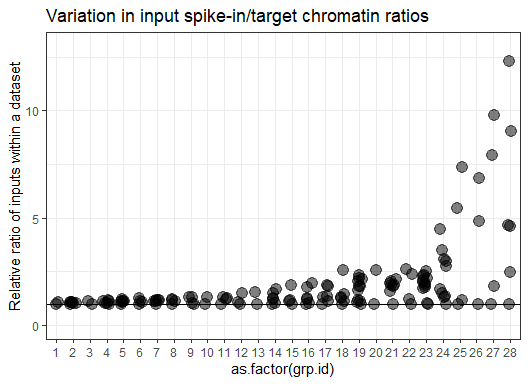
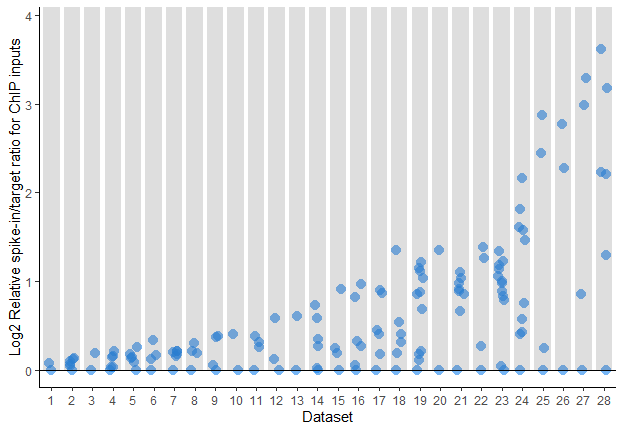
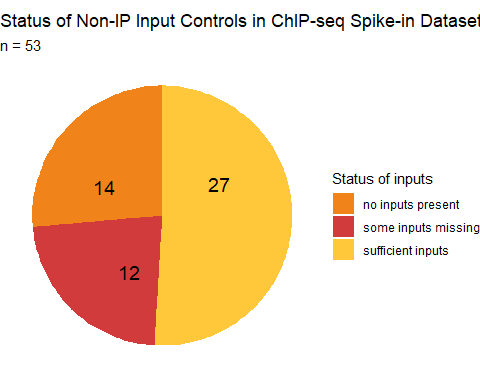

spike_correspondence_figure3
================

- <a href="#spike-intarget-ratios-in-all-inputs"
  id="toc-spike-intarget-ratios-in-all-inputs">spike-in/target ratios in
  all inputs</a>
  - <a href="#apply-function-to-each-dataset-within-dataframe"
    id="toc-apply-function-to-each-dataset-within-dataframe">Apply function
    to each dataset within dataframe</a>
- <a href="#revisions-plot" id="toc-revisions-plot">Revisions plot</a>
- <a href="#pie-chart" id="toc-pie-chart">pie chart</a>

``` r
library(tidyverse)
```

    Warning: package 'ggplot2' was built under R version 4.3.3

    Warning: package 'lubridate' was built under R version 4.3.2

    ── Attaching core tidyverse packages ──────────────────────── tidyverse 2.0.0 ──
    ✔ dplyr     1.1.3     ✔ readr     2.1.4
    ✔ forcats   1.0.0     ✔ stringr   1.5.1
    ✔ ggplot2   3.5.1     ✔ tibble    3.2.1
    ✔ lubridate 1.9.3     ✔ tidyr     1.3.0
    ✔ purrr     1.0.2     
    ── Conflicts ────────────────────────────────────────── tidyverse_conflicts() ──
    ✖ dplyr::filter() masks stats::filter()
    ✖ dplyr::lag()    masks stats::lag()
    ℹ Use the conflicted package (<http://conflicted.r-lib.org/>) to force all conflicts to become errors

``` r
theme_set(theme_bw())
library(RColorBrewer)
```

# spike-in/target ratios in all inputs

## Apply function to each dataset within dataframe

``` r
get_input_mean <- function(df, .df) {
   dfnew <- df                                # copy input dataframe
   df$var <- as.numeric(df$var)
   mean <- as.numeric(mean(df$var, na.rm = TRUE)) # make var column
   dfnew %>%
     mutate(mean = mean)                          # add to df
}
```

# Revisions plot

``` r
public_data_submit_revisions <- read.delim("~/Research/spike_commentary/public_data_submit_revisions.tsv")

public_data_submit_revisions$filtered.spike_target <- as.numeric(public_data_submit_revisions$filtered.spike_target)
```

``` r
# function to apply to each author: 
get_input_variation <- function(df, .df) {
   dfnew <- df                                # copy input dataframe
   mininput <- min(df$filtered.spike_target, na.rm = T) # get min from spike_targ
   var <- as.numeric((df$filtered.spike_target)/mininput) # make var column
   dfnew %>%
     mutate(var = var)                          # add to df
}
```

``` r
# grouping df 
input_var_stats <- public_data_submit_revisions %>% 
  filter(Mark == "input") %>%      # only inputs
  group_by(Author) %>%             # need to group by paper
  group_map(get_input_variation, .keep = TRUE) %>% 
  bind_rows()
```

Remove any papers with only 1 input, since we are plotting variation
between inputs within a dataset:

``` r
input_var_stats_mult <- input_var_stats %>%
  group_by(Author) %>%
  filter(n()>1)
```

Get mean of variation

``` r
get_input_mean <- function(df, .df) {
   dfnew <- df                                # copy input dataframe
   df$var <- as.numeric(df$var)
   mean <- as.numeric(mean(df$var, na.rm = TRUE)) # make var column
   dfnew %>%
     mutate(meanvar = mean)                          # add to df
}
```

``` r
input_var_stats_mult <- input_var_stats_mult %>%
  group_by(Author) %>%
 group_map(get_input_mean, .keep = TRUE) %>%
  bind_rows()
```

I used to use `cur_group_id` by itself to get a unique group identifier,
but this ranks the groups in alphabetical order. Instead, we want to
rank by increasing input variation (meanvar), then order from 1-X.

First need to `arrange` by increasing meanvar, then `group_by` Author
(set as factor with levels in order of groups after arrange function),
then set group id to `cur_group_id`

``` r
input_var_stats_mult <- input_var_stats_mult %>%
  arrange(meanvar) %>%
  group_by(Author = factor(Author, levels = unique(Author))) %>%
  mutate(grp.id = cur_group_id())
```

``` r
input_var_stats_mult %>% 
  drop_na(var) %>% drop_na(grp.id) %>% 
  ggplot() + 
  aes(x = as.factor(grp.id), y =var) + 
  geom_jitter(size = 4, alpha = 0.5, width = 0.2) + 
  geom_hline(yintercept = 1) + 
  coord_cartesian(ylim = c(0, 13)) + 
  labs(title = "Variation in input spike-in/target chromatin ratios", y = "Relative ratio of inputs within a dataset") + 
  theme(legend.position = "none")
```



Nicer graph with publishing aesthetics:

Plotting on log scale to show extent of variation:

``` r
input_var_revision <- input_var_stats_mult %>% 
  drop_na(var) %>% ggplot() + 
  aes(x = as.factor(grp.id)) + 
  geom_jitter(aes(y = log2(var)), size = 3.5, alpha = 0.6, width = 0.17, pch=21, fill = "dodgerblue2", stroke = NA) + 
  geom_hline(yintercept = 0) + 
  # scale_y_break(c(5, 8.5), ticklabels=c(9, 10, 11, 12, 13)) + 
  coord_cartesian(ylim = c(0, 3.9))+
  labs(y = "Log2 Relative spike-in/target ratio for ChIP inputs", 
       x = "Dataset") + 
  theme_classic() + 
  scale_y_continuous(breaks=seq(0,5,1)) +
 geom_col(aes(x = grp.id, y = 4), alpha = 0.2, width = 0.8) 

input_var_revision
```



``` r
ggsave("input_var_revision.svg", input_var_revision, width = 6.5, height = 4.5)

ggsave("input_var_revision.pdf", input_var_revision, width = 6.5, height = 4.5)
```

Median:

``` r
median(input_var_stats_mult$meanvar)
```

    [1] 1.418471

# pie chart

``` r
input_presence <- data.frame(input_status = c("sufficient inputs", "some inputs missing", "no inputs present"), paper_count = c(27, 12, 14))
```

``` r
library(scales)
```

    Warning: package 'scales' was built under R version 4.3.3


    Attaching package: 'scales'

    The following object is masked from 'package:purrr':

        discard

    The following object is masked from 'package:readr':

        col_factor

``` r
input_piechart <- ggplot(input_presence, aes(x="", y= paper_count, fill=input_status)) +
  geom_bar(stat="identity", width=1, alpha = 0.9) +
  coord_polar("y", start=0) +
  theme_void() +
  geom_text(aes(y = paper_count/3 + c(0, cumsum(paper_count)[-length(paper_count)]), 
            label = paper_count), size=5) + 
  scale_fill_manual(values = c("darkorange2","firebrick3","goldenrod1"), name = "Status of inputs") + 
  labs(title = "Status of Non-IP Input Controls in ChIP-seq Spike-in Datasets",
       subtitle = "n = 53")

input_piechart
```



``` r
ggsave("input_piechart.svg", input_piechart, height = 4, width =5)
```
