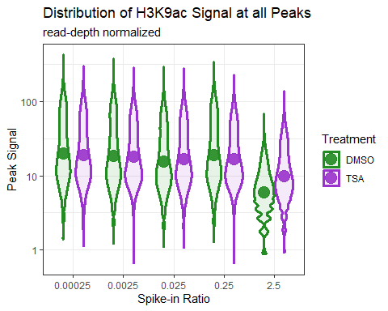
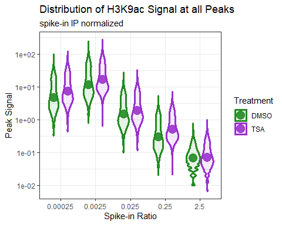
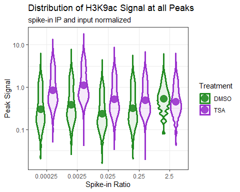

spike_correspondence_figure4
================

- <a href="#data-generation" id="toc-data-generation">Data generation:</a>
  - <a href="#read-normalized-peak-signal"
    id="toc-read-normalized-peak-signal">read normalized peak signal</a>
  - <a href="#normalize-to-spike-in-ip-only"
    id="toc-normalize-to-spike-in-ip-only">normalize to spike-in IP only</a>
    - <a href="#spike-in-ip-normalized-figure-4b"
      id="toc-spike-in-ip-normalized-figure-4b">spike-in ip normalized (Figure
      4b)</a>
  - <a href="#normalize-to-spike-in-ip-and-inputs"
    id="toc-normalize-to-spike-in-ip-and-inputs">normalize to spike-in IP
    and inputs</a>
    - <a href="#spike-in-ip-and-input-normalized-figure-4c"
      id="toc-spike-in-ip-and-input-normalized-figure-4c">spike-in ip and
      input normalized (Figure 4c)</a>

``` r
library(tidyverse)
```

    Warning: package 'ggplot2' was built under R version 4.3.3

    Warning: package 'lubridate' was built under R version 4.3.2

    ── Attaching core tidyverse packages ──────────────────────── tidyverse 2.0.0 ──
    ✔ dplyr     1.1.3     ✔ readr     2.1.4
    ✔ forcats   1.0.0     ✔ stringr   1.5.1
    ✔ ggplot2   3.5.1     ✔ tibble    3.2.1
    ✔ lubridate 1.9.3     ✔ tidyr     1.3.0
    ✔ purrr     1.0.2     
    ── Conflicts ────────────────────────────────────────── tidyverse_conflicts() ──
    ✖ dplyr::filter() masks stats::filter()
    ✖ dplyr::lag()    masks stats::lag()
    ℹ Use the conflicted package (<http://conflicted.r-lib.org/>) to force all conflicts to become errors

``` r
theme_set(theme_classic())
library(DescTools)          # used for area under curve estimates
```

    Warning: package 'DescTools' was built under R version 4.3.3

``` r
library(ggpp)             # used for position_nudge_center, other position adjustments
```

    Warning: package 'ggpp' was built under R version 4.3.3

    Registered S3 methods overwritten by 'ggpp':
      method                  from   
      heightDetails.titleGrob ggplot2
      widthDetails.titleGrob  ggplot2

    Attaching package: 'ggpp'

    The following object is masked from 'package:ggplot2':

        annotate

# Data generation:

Make megasample ChIP tag directory:

``` bash
makeTagDirectory 56_combined_H3K9ac_sync.hg38-tagdir -d *yeast*.hg38.all.nosuffx2-tagdir

findPeaks 56_combined_H3K9ac_sync.hg38-tagdir -style histone -size 1000 -minDist 2500 -o 56_combined_H3K9ac_sync.hg38.recommendedregions.txt -i 56_combined_input_sync.hg38-tagdir

annotatePeaks.pl 56_combined_H3K9ac_sync.hg38.recommendedregions.txt hg38 -size 1000 -d *.hg38.all.nosuffx2-tagdir > counts_megapeaks_hg38_LH56.txt
```

``` r
counts_megapeaks_hg38_LH56 <- read_delim("~/Research/LH_56/counts_megapeaks_hg38_LH56.txt")
```

    Rows: 33500 Columns: 40
    ── Column specification ────────────────────────────────────────────────────────
    Delimiter: "\t"
    chr (13): PeakID (cmd=annotatePeaks.pl 56_combined_H3K9ac_sync.hg38.recommen...
    dbl (27): Start, End, Peak Score, Focus Ratio/Region Size, Distance to TSS, ...

    ℹ Use `spec()` to retrieve the full column specification for this data.
    ℹ Specify the column types or set `show_col_types = FALSE` to quiet this message.

``` r
process_counts_annotpeaks <- function(counts_annotpeaks, .x) {
  colnames(counts_annotpeaks)[1] <- "PeakID"
  counts_annotpeaks <- counts_annotpeaks %>% 
    select(PeakID, contains(c("DMSO", "TSA"))) %>%
    select(!contains(c("10M", "100M"))) %>% 
    rename_with(~ gsub("hg38.all.nosuffx2.tagdir.", "", .x), contains("hg38")) %>% 
    rename_with(~ gsub("^[[:digit:]]+", "", .x), contains("Tag")) %>%
    rename_with(~ gsub("^[[:alpha:]]", "HelaS3_sync", .x), contains("Tag")) %>%
    rename_with(~ gsub("sync_0-1k", "0.00025spike_H3K9ac", .x), contains("Tag")) %>%
    rename_with(~ gsub("sync_1k", "0.0025spike_H3K9ac", .x), contains("Tag")) %>%
    rename_with(~ gsub("sync_10k", "0.025spike_H3K9ac", .x), contains("Tag")) %>%
    rename_with(~ gsub("sync_100k", "0.25spike_H3K9ac", .x), contains("Tag")) %>%
    rename_with(~ gsub("sync_1M", "2.5spike_H3K9ac", .x), contains("Tag")) %>%
    rename_with(~ gsub("_yeast", "", .x), contains("Tag")) %>%
    rename_with(~ gsub("\\.[[:digit:]]$", "_minus", .x), contains("Tag")) %>% 
    rename_with(~ gsub("\\ Count.+", "", .x), contains("Tag")) # remove chrs after Tag
} 
```

``` r
counts_megapeaks_hg38_LH56_clean <- process_counts_annotpeaks(counts_megapeaks_hg38_LH56)

colnames(counts_megapeaks_hg38_LH56_clean)
```

     [1] "PeakID"                                  
     [2] "HelaS3_sync_DMSO_0.00025spike_H3K9ac.Tag"
     [3] "HelaS3_sync_DMSO_0.0025spike_H3K9ac.Tag" 
     [4] "HelaS3_sync_DMSO_0.025spike_H3K9ac.Tag"  
     [5] "HelaS3_sync_DMSO_0.25spike_H3K9ac.Tag"   
     [6] "HelaS3_sync_DMSO_2.5spike_H3K9ac.Tag"    
     [7] "HelaS3_sync_TSA_0.00025spike_H3K9ac.Tag" 
     [8] "HelaS3_sync_TSA_0.0025spike_H3K9ac.Tag"  
     [9] "HelaS3_sync_TSA_0.025spike_H3K9ac.Tag"   
    [10] "HelaS3_sync_TSA_0.25spike_H3K9ac.Tag"    
    [11] "HelaS3_sync_TSA_2.5spike_H3K9ac.Tag"     

``` r
counts_megapeaks_hg38_LH56_tidy <- counts_megapeaks_hg38_LH56_clean %>% 
  select(PeakID, contains("Tag")) %>%
  pivot_longer(
      cols = !PeakID, 
      names_to = "Sample", 
      values_to = "Peak_Tags")
```

``` r
counts_megapeaks_hg38_LH56_sep <- counts_megapeaks_hg38_LH56_tidy[grep("Tag", counts_megapeaks_hg38_LH56_tidy$Sample), ] %>% separate_wider_regex(cols = Sample, patterns = c(
  cell = ".+",
  "\\_",
  mitotic = ".+",
  "\\_",
  treatment = "[:alpha:]+", 
  "\\_", 
  yeast_ratio = ".+", 
  "spike", "\\_", 
  antibody = "H3K9ac", ".Tag"))
```

### read normalized peak signal

``` r
ggplot(counts_megapeaks_hg38_LH56_sep) + 
 aes(x = yeast_ratio, y = Peak_Tags, group = interaction(treatment, yeast_ratio), fill = treatment, color = treatment) + 
  geom_violin(alpha = 0.1, width = 0.8, linewidth = 1.1) + 
  stat_summary(fun = "mean", geom = "point", size = 5, alpha = 0.9, position = position_nudge_center(c(-0.2, 0.2))) + 
  scale_fill_manual(
    values = c("forestgreen", "darkorchid"),
    name = "Treatment") + 
  scale_color_manual(
    values = c("forestgreen", "darkorchid3"),
    name = "Treatment") + 
  scale_y_log10() + theme_bw() +
  labs(title = "Distribution of H3K9ac Signal at all Peaks", 
       subtitle = "read-depth normalized", 
       x = "Spike-in Ratio", y = "Peak Signal") 
```

    Warning in scale_y_log10(): log-10 transformation introduced infinite values.
    log-10 transformation introduced infinite values.

    Warning: Removed 401 rows containing non-finite outside the scale range
    (`stat_ydensity()`).

    Warning: Removed 401 rows containing non-finite outside the scale range
    (`stat_summary()`).



``` r
## get rid of outliers, just plot middle quantiles
```

## normalize to spike-in IP only

``` r
mydata_sequencing_statistics_spikeintitration <- read.delim("~/Research/spike_commentary/mydata_sequencing_statistics_spikeintitration.txt")
```

``` r
knitr::kable(mydata_sequencing_statistics_spikeintitration)
```

| Sample.ID                            | human.cells | spike.in.ratio | total.reads..M. | hg38.tagdir.reads | sac3.tagdir.reads | yeast.human.cells | yeast.human.reads.200 | human.H3K9ac..peaks | FRIP   | spike_norm |
|:-------------------------------------|------------:|---------------:|----------------:|------------------:|------------------:|------------------:|----------------------:|--------------------:|:-------|-----------:|
| 56a_RGFP_sync_0.1k_yeast             |       4e+05 |        1.0e+02 |         8.07483 |           7051229 |             10154 |           3.0e-04 |                0.2880 |                 226 | 0.34%  |         NA |
| 56b_RGFP_sync_1k_yeast               |       4e+05 |        1.0e+03 |        12.60158 |          11231892 |             33358 |           2.5e-03 |                0.5940 |                1580 | 2.02%  |         NA |
| 56c_RGFP_sync_10k_yeast              |       4e+05 |        1.0e+04 |        15.97214 |          14149489 |            129267 |           2.5e-02 |                1.8272 |                1305 | 1.71%  |         NA |
| 56d_RGFP_sync_100k_yeast             |       4e+05 |        1.0e+05 |        12.40176 |          10235077 |            509853 |           2.5e-01 |                9.9629 |               15499 | 12.73% |         NA |
| 56e_RGFP_sync_1M_yeast               |       4e+05 |        1.0e+06 |        17.34068 |          11259450 |           3915331 |           2.5e+00 |               69.5475 |                4013 | 4.43%  |         NA |
| 56f_RGFP_sync_10M_yeast              |       4e+05 |        1.0e+07 |        12.58236 |           4535211 |           6219564 |           2.5e+01 |              274.2789 |                   6 | 0.03%  |         NA |
| 56g_RGFP_sync_100M_yeast             |       4e+05 |        1.0e+08 |        14.28208 |           3623997 |           8555782 |           2.5e+02 |              472.1738 |                   4 | 0.02%  |         NA |
| HelaS3_sync_DMSO_0.00025spike_H3K9ac |       4e+05 |        2.5e-04 |         8.34348 |           7262674 |            154641 |           3.0e-04 |                4.2585 |                9349 | 16.75% |   66.95755 |
| HelaS3_sync_DMSO_0.0025spike_H3K9ac  |       4e+05 |        2.5e-03 |         9.96056 |           8596493 |             67776 |           2.5e-03 |                1.5768 |                7271 | 12.58% |   47.35135 |
| HelaS3_sync_DMSO_0.025spike_H3K9ac   |       4e+05 |        2.5e-02 |        11.64365 |           9449310 |            501427 |           2.5e-02 |               10.6130 |               10831 | 13.03% |   66.08344 |
| HelaS3_sync_DMSO_0.25spike_H3K9ac    |       4e+05 |        2.5e-01 |        12.30078 |           8159585 |           2614330 |           2.5e-01 |               64.0800 |                3829 | 7.56%  |   60.11821 |
| HelaS3_sync_DMSO_2.5spike_H3K9ac     |       4e+05 |        2.5e+00 |        19.56782 |          11272855 |           5042781 |           2.5e+00 |               89.4677 |                   1 | 0.00%  |   11.10352 |
| HelaS3_sync_TSA_0.00025spike_H3K9ac  |       4e+05 |        2.5e-04 |         9.93784 |           9276532 |            116730 |           3.0e-04 |                2.5167 |                2330 | 4.63%  |   21.96073 |
| HelaS3_sync_TSA_0.0025spike_H3K9ac   |       4e+05 |        2.5e-03 |        16.22951 |          15559612 |             83097 |           2.5e-03 |                1.0681 |                 661 | 1.41%  |   15.98952 |
| HelaS3_sync_TSA_0.025spike_H3K9ac    |       4e+05 |        2.5e-02 |        10.76985 |           9590942 |            421392 |           2.5e-02 |                8.7873 |                1394 | 2.51%  |   32.08215 |
| HelaS3_sync_TSA_0.25spike_H3K9ac     |       4e+05 |        2.5e-01 |        18.37823 |          15602483 |           2521467 |           2.5e-01 |               32.3214 |                2701 | 4.15%  |   33.58765 |
| HelaS3_sync_TSA_2.5spike_H3K9ac      |       4e+05 |        2.5e+00 |        18.52916 |          10760187 |           7683889 |           2.5e+00 |              142.8207 |                 113 | 0.14%  |   21.79304 |
| 56a_input                            |       4e+05 |        1.0e+02 |              NA |            728048 |               374 |           3.0e-04 |                0.1027 |                  NA |        |         NA |
| 56b_input                            |       4e+05 |        1.0e+03 |              NA |            862234 |               804 |           2.5e-03 |                0.1865 |                  NA |        |         NA |
| 56c_input                            |       4e+05 |        1.0e+04 |              NA |            831028 |              2701 |           2.5e-02 |                0.6500 |                  NA |        |         NA |
| 56d_input                            |       4e+05 |        1.0e+05 |              NA |           2258598 |             16699 |           2.5e-01 |                1.4787 |                  NA |        |         NA |
| 56e_input                            |       4e+05 |        1.0e+06 |              NA |           1076260 |             52407 |           2.5e+00 |                9.7387 |                  NA |        |         NA |
| 56f_input                            |       4e+05 |        1.0e+07 |              NA |            444204 |            235859 |           2.5e+01 |              106.1940 |                  NA |        |         NA |
| 56g_input                            |       4e+05 |        1.0e+08 |              NA |            192860 |            470337 |           2.5e+02 |              487.7497 |                  NA |        |         NA |
| HelaS3_sync_DMSO_0.00025spike_input  |       4e+05 |        2.5e-04 |              NA |           1106696 |               352 |           3.0e-04 |                0.0636 |                  NA |        |         NA |
| HelaS3_sync_DMSO_0.0025spike_input   |       4e+05 |        2.5e-03 |              NA |            941611 |               157 |           2.5e-03 |                0.0333 |                  NA |        |         NA |
| HelaS3_sync_DMSO_0.025spike_input    |       4e+05 |        2.5e-02 |              NA |           1893563 |              1521 |           2.5e-02 |                0.1606 |                  NA |        |         NA |
| HelaS3_sync_DMSO_0.25spike_input     |       4e+05 |        2.5e-01 |              NA |            627798 |              3346 |           2.5e-01 |                1.0659 |                  NA |        |         NA |
| HelaS3_sync_DMSO_2.5spike_input      |       4e+05 |        2.5e+00 |              NA |            585261 |             23579 |           2.5e+00 |                8.0576 |                  NA |        |         NA |
| HelaS3_sync_TSA_0.00025spike_input   |       4e+05 |        2.5e-04 |              NA |            579523 |               332 |           3.0e-04 |                0.1146 |                  NA |        |         NA |
| HelaS3_sync_TSA_0.0025spike_input    |       4e+05 |        2.5e-03 |              NA |            485011 |               162 |           2.5e-03 |                0.0668 |                  NA |        |         NA |
| HelaS3_sync_TSA_0.025spike_input     |       4e+05 |        2.5e-02 |              NA |            576184 |               789 |           2.5e-02 |                0.2739 |                  NA |        |         NA |
| HelaS3_sync_TSA_0.25spike_input      |       4e+05 |        2.5e-01 |              NA |            795184 |              3826 |           2.5e-01 |                0.9623 |                  NA |        |         NA |
| HelaS3_sync_TSA_2.5spike_input       |       4e+05 |        2.5e+00 |              NA |            720465 |             23608 |           2.5e+00 |                6.5535 |                  NA |        |         NA |

``` r
mydata_sequencing_statistics_spikeintitration_IPs <- 
  mydata_sequencing_statistics_spikeintitration %>%
  filter(grepl("H3K9ac", Sample.ID))
  
megapeak_ip_norm <- counts_megapeaks_hg38_LH56_clean
colnames(megapeak_ip_norm)
```

     [1] "PeakID"                                  
     [2] "HelaS3_sync_DMSO_0.00025spike_H3K9ac.Tag"
     [3] "HelaS3_sync_DMSO_0.0025spike_H3K9ac.Tag" 
     [4] "HelaS3_sync_DMSO_0.025spike_H3K9ac.Tag"  
     [5] "HelaS3_sync_DMSO_0.25spike_H3K9ac.Tag"   
     [6] "HelaS3_sync_DMSO_2.5spike_H3K9ac.Tag"    
     [7] "HelaS3_sync_TSA_0.00025spike_H3K9ac.Tag" 
     [8] "HelaS3_sync_TSA_0.0025spike_H3K9ac.Tag"  
     [9] "HelaS3_sync_TSA_0.025spike_H3K9ac.Tag"   
    [10] "HelaS3_sync_TSA_0.25spike_H3K9ac.Tag"    
    [11] "HelaS3_sync_TSA_2.5spike_H3K9ac.Tag"     

``` r
for (i in 1:ncol(megapeak_ip_norm)) {
  if (!colnames(megapeak_ip_norm)[i] %in% paste0((mydata_sequencing_statistics_spikeintitration_IPs$Sample.ID), ".Tag")) {
    next()
  }
  
  # make get current sampleID, remove .Coverage 
 seqstatIDi <- sub('.Tag', "", colnames(megapeak_ip_norm[i]))
 

 # get normalization factor from sequencing stats (df3)
 
 normfactori <- mydata_sequencing_statistics_spikeintitration_IPs[grep(seqstatIDi, mydata_sequencing_statistics_spikeintitration_IPs$Sample.ID), 8]
 
 # multiply read_norm coverage by norm factor, assign to new df
megapeak_ip_norm[, i] <- 
  counts_megapeaks_hg38_LH56_clean[, i]/(normfactori)
  
}
```

Make individual sample count dataframe in tidy format:

``` r
megapeak_ip_norm_tidy <- megapeak_ip_norm %>% 
  select(PeakID, contains("Tag")) %>%
  pivot_longer(
      cols = !PeakID, 
      names_to = "Sample", 
      values_to = "Peak_Tags")
```

``` r
megapeak_ip_norm_sep <- megapeak_ip_norm_tidy[grep("Tag", megapeak_ip_norm_tidy$Sample), ] %>% separate_wider_regex(cols = Sample, patterns = c(
  cell = ".+",
  "\\_",
  mitotic = ".+",
  "\\_",
  treatment = "[:alpha:]+", 
  "\\_", 
  yeast_ratio = ".+", 
  "spike", "\\_", 
  antibody = "H3K9ac", ".Tag"))
```

### spike-in ip normalized (Figure 4b)

``` r
ggplot(megapeak_ip_norm_sep) + 
 aes(x = yeast_ratio, y = Peak_Tags, group = interaction(treatment, yeast_ratio), fill = treatment, color = treatment) + 
  geom_violin(alpha = 0.1, width = 0.8, linewidth = 1.1) + 
  stat_summary(fun = "mean", geom = "point", size = 5, alpha = 0.9, position = position_nudge_center(c(-0.2, 0.2))) + 
  scale_fill_manual(
    values = c("forestgreen", "darkorchid"),
    name = "Treatment") + 
  scale_color_manual(
    values = c("forestgreen", "darkorchid3"),
    name = "Treatment") + 
  scale_y_log10() + theme_bw() +
  labs(title = "Distribution of H3K9ac Signal at all Peaks", 
       subtitle = "spike-in IP normalized", 
       x = "Spike-in Ratio", y = "Peak Signal") 
```

    Warning in scale_y_log10(): log-10 transformation introduced infinite values.
    log-10 transformation introduced infinite values.

    Warning: Removed 401 rows containing non-finite outside the scale range
    (`stat_ydensity()`).

    Warning: Removed 401 rows containing non-finite outside the scale range
    (`stat_summary()`).



``` r
## get rid of outliers, just plot middle quantiles
```

## normalize to spike-in IP and inputs

``` r
megapeak_ip_input_norm <- counts_megapeaks_hg38_LH56_clean
colnames(megapeak_ip_input_norm)
```

     [1] "PeakID"                                  
     [2] "HelaS3_sync_DMSO_0.00025spike_H3K9ac.Tag"
     [3] "HelaS3_sync_DMSO_0.0025spike_H3K9ac.Tag" 
     [4] "HelaS3_sync_DMSO_0.025spike_H3K9ac.Tag"  
     [5] "HelaS3_sync_DMSO_0.25spike_H3K9ac.Tag"   
     [6] "HelaS3_sync_DMSO_2.5spike_H3K9ac.Tag"    
     [7] "HelaS3_sync_TSA_0.00025spike_H3K9ac.Tag" 
     [8] "HelaS3_sync_TSA_0.0025spike_H3K9ac.Tag"  
     [9] "HelaS3_sync_TSA_0.025spike_H3K9ac.Tag"   
    [10] "HelaS3_sync_TSA_0.25spike_H3K9ac.Tag"    
    [11] "HelaS3_sync_TSA_2.5spike_H3K9ac.Tag"     

``` r
for (i in 1:ncol(megapeak_ip_input_norm)) {
  if (!colnames(megapeak_ip_input_norm)[i] %in% paste0((mydata_sequencing_statistics_spikeintitration$Sample.ID), ".Tag")) {
    next()
  }
  
  # make get current sampleID, remove .Coverage 
 seqstatIDi <- sub('.Tag', "", colnames(megapeak_ip_input_norm[i]))
 

 # get normalization factor from sequencing stats (df3)
 
 normfactori <- mydata_sequencing_statistics_spikeintitration[grep(seqstatIDi, mydata_sequencing_statistics_spikeintitration$Sample.ID), 11]
 
 # multiply read_norm coverage by norm factor, assign to new df
megapeak_ip_input_norm[, i] <- 
  counts_megapeaks_hg38_LH56_clean[, i]/(normfactori)
  
}
```

Make individual sample count dataframe in tidy format:

``` r
megapeak_ip_input_norm_tidy <- megapeak_ip_input_norm %>% 
  select(PeakID, contains("Tag")) %>%
  pivot_longer(
      cols = !PeakID, 
      names_to = "Sample", 
      values_to = "Peak_Tags")
```

``` r
megapeak_ip_input_norm_sep <- megapeak_ip_input_norm_tidy[grep("Tag", megapeak_ip_input_norm_tidy$Sample), ] %>% separate_wider_regex(cols = Sample, patterns = c(
  cell = ".+",
  "\\_",
  mitotic = ".+",
  "\\_",
  treatment = "[:alpha:]+", 
  "\\_", 
  yeast_ratio = ".+", 
  "spike", "\\_", 
  antibody = "H3K9ac", ".Tag"))
```

### spike-in ip and input normalized (Figure 4c)

``` r
ggplot(megapeak_ip_input_norm_sep) + 
 aes(x = yeast_ratio, y = Peak_Tags, group = interaction(treatment, yeast_ratio), fill = treatment, color = treatment) + 
  geom_violin(alpha = 0.1, width = 0.8, linewidth = 1.1) + 
  stat_summary(fun = "mean", geom = "point", size = 5, alpha = 0.9, position = position_nudge_center(c(-0.2, 0.2))) + 
  scale_fill_manual(
    values = c("forestgreen", "darkorchid"),
    name = "Treatment") + 
  scale_color_manual(
    values = c("forestgreen", "darkorchid3"),
    name = "Treatment") + 
  scale_y_log10() + theme_bw() +
  labs(title = "Distribution of H3K9ac Signal at all Peaks", 
       subtitle = "spike-in IP and input normalized", 
       x = "Spike-in Ratio", y = "Peak Signal") 
```

    Warning in scale_y_log10(): log-10 transformation introduced infinite values.
    log-10 transformation introduced infinite values.

    Warning: Removed 401 rows containing non-finite outside the scale range
    (`stat_ydensity()`).

    Warning: Removed 401 rows containing non-finite outside the scale range
    (`stat_summary()`).


